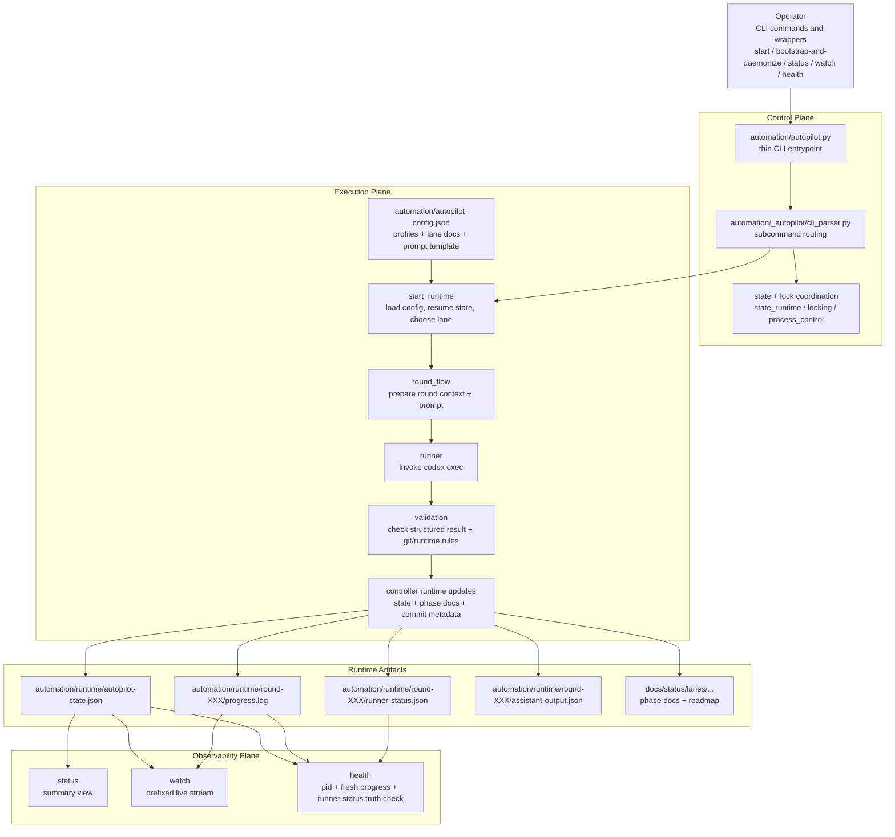
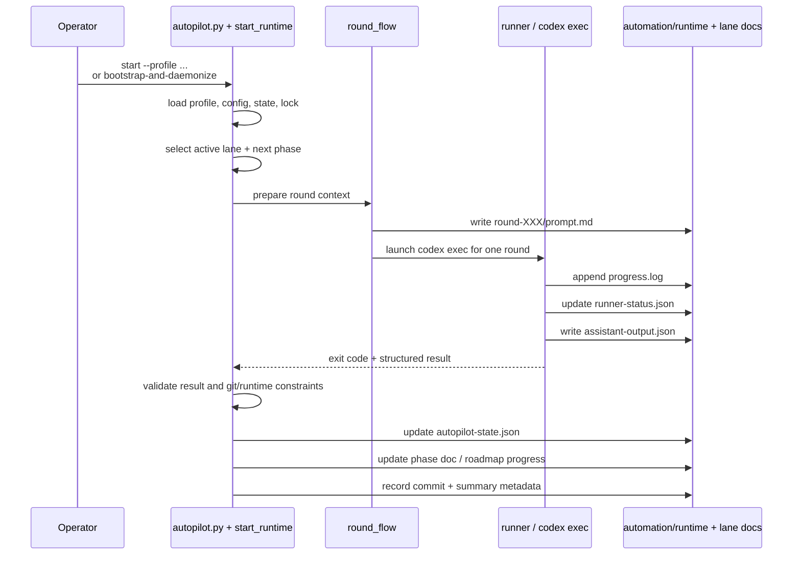

# Codex Autopilot Runtime Architecture

## What this shows

This document explains the generated target-repo runtime after the scaffold has already been installed. It focuses on how the repo-local Python controller drives unattended rounds, where the runtime artifacts live, and how `status`, `watch`, and `health` observe the run.

The key mental model is:

- the scaffold installs a durable Python control loop into the repo,
- each round is delegated to a child `codex exec`,
- the controller validates the round and updates machine-readable state,
- observer commands read that state from different angles.

## Main runtime architecture

- The controller is the durable loop owner; `codex exec` is only the worker for one round.
- `automation/autopilot-config.json`, profile JSON, and lane docs together define what the next round should attempt.
- Runtime state is split on purpose: one summary state file, one live progress stream, one runner liveness artifact, one structured assistant result, plus lane-local docs.

## Single-round sequence

- `round_flow` is where the controller turns repo intent into a concrete per-round prompt and runtime directory.
- The runner writes artifacts during execution so observers can inspect the live state before the round fully ends.
- Validation is where the scaffold enforces its contract: schema, build/deploy reporting, commit prefix rules, dirty-worktree expectations, and similar safety checks.

## Key runtime artifacts

- `automation/runtime/autopilot-state.json`
  - The controller's summary view of the current run: current round, lane progress, status, last successful metadata.
- `automation/runtime/round-XXX/progress.log`
  - Human-readable live stream for the active round; `watch` tails this with autopilot metadata prefixes.
- `automation/runtime/round-XXX/runner-status.json`
  - Child-runner liveness evidence, including the `codex exec` child pid and `exec_confirmed_at`.
- `automation/runtime/round-XXX/assistant-output.json`
  - Structured final result returned by the round worker and consumed by validation.
- `docs/status/lanes/<lane-id>/autopilot-phase-N.md`
  - Lane-local record of what just happened in the latest phase.
- `docs/status/lanes/<lane-id>/autopilot-round-roadmap.md`
  - Lane-local queue source for what should happen next.

## Reading the runtime in practice

- Use `status` when you want the current high-level summary from `autopilot-state.json`.
- Use `watch` when you want the live operator stream with lane, phase, round, and status prefixes while `progress.log` is updating.
- Use `health` when `status=active` looks suspicious. It is the stronger truth source because it checks three things together:
  - the autopilot parent pid is still alive,
  - the watched `progress.log` is fresh,
  - the watched `runner-status.json` still proves a live child `codex exec`.

That distinction matters because a stale state file alone does not prove the unattended runner is still healthy.

## What is intentionally out of scope

This explainer intentionally leaves out advanced operator flows such as `review-gated` review wrappers, remote Mac rollout, `restart-after-next-commit`, and platform-specific wrapper internals. Those features sit on top of the same runtime skeleton shown here.
