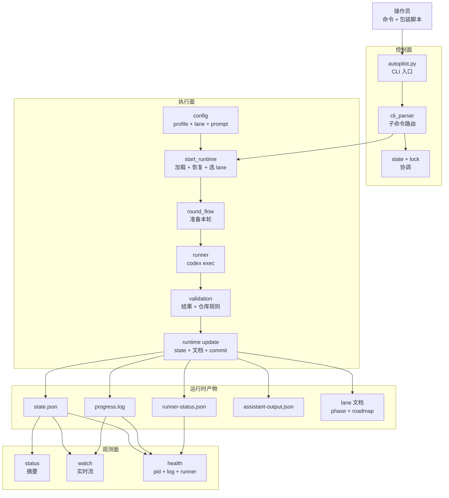
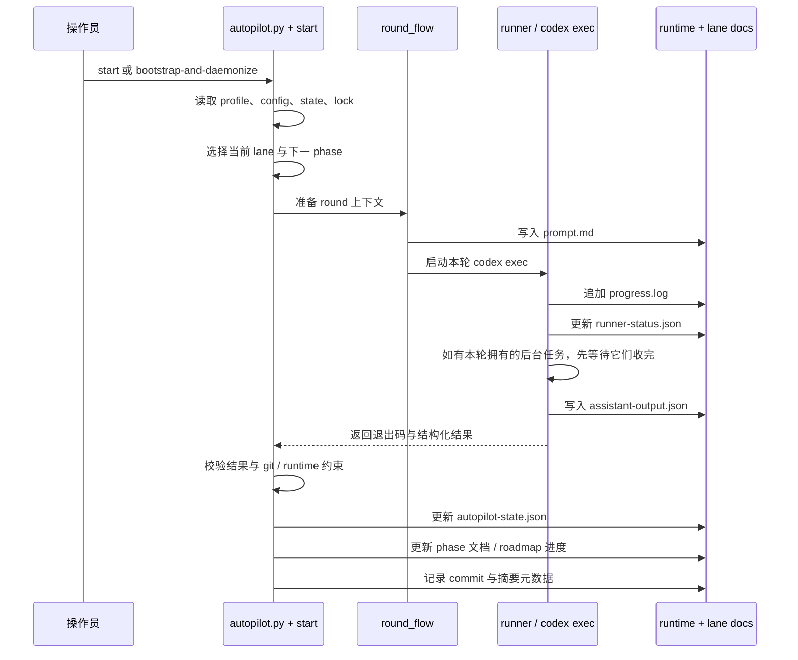

# Codex Autopilot 运行架构

## 这份文档讲什么

这份文档解释的是：**脚手架已经安装到目标仓库之后**，生成出来的 repo-local autopilot 运行时到底是怎么工作的。重点是：

- Python 控制器如何持续驱动无人值守 round，
- 运行时产物写到哪里，
- `status`、`watch`、`health` 分别从什么角度观察运行状态。

核心心智模型可以记成：

- 脚手架会把一个可持续运行的 Python 控制环放进目标仓库，
- 每一轮真正执行工作的，是它拉起的子 `codex exec`，
- 控制器负责校验结果、更新机器可读状态，
- 观察命令再从这些状态和日志里还原“现在到底跑到哪了”。

## 主运行架构图

- 控制器才是持久循环的拥有者；`codex exec` 只是“这一轮的执行工人”。
- `automation/autopilot-config.json`、profile JSON、lane 文档共同决定“下一轮要做什么”。
- 运行时状态是故意拆开的：摘要 state、实时进度日志、runner 存活证据、结构化输出结果，以及 lane 文档。

## 单轮时序图

- `round_flow` 负责把“仓库当前意图”转成一轮可执行的 prompt 和 runtime 目录。
- runner 在执行过程中就会持续写产物，所以观察命令不必等整轮结束才有东西看。
- `start` 现在可以通过 `--require-green-baseline` 在第 1 轮前可选执行一次 green baseline 预检；它会跑当前配置的 lint/typecheck/test/build 命令，但默认仍不强制。
- `validation` 是脚手架真正执行契约的地方：schema、build/deploy 上报、commit prefix、dirty worktree 之类的安全规则都在这里落实。

## 对后台任务敏感的完成契约

round 的边界故意晚于“主 helper 响应结束”。worker 或目标仓库自己的 implementation helper 可以启动后台任务，但 round 不能因此提前收口；必须等后台任务收完、它们负责的 repo-visible 改动落地、最终产物写完之后，才能进入成功校验。

生成的 schema 要求 worker 上报：

- `background_tasks_used`
- `background_tasks_completed`
- `repo_visible_work_landed`
- `final_artifacts_written`

如果后台任务被使用但没有完成、repo-visible work 没落地、或者 final artifacts 没写完，controller validation 会拒绝 `success`。如果 runner 退出后缺少 `assistant-output.json`，应把它理解为 completion lifecycle failure，而不是理解成“后台任务不可能跑”或目标代码质量失败。

这只是 scaffold 层的基线契约。已经有自定义 OpenCode wrapper / controller 的目标仓库，第二阶段仍然需要刷新 scaffold，并把 helper 自己的后台任务 drain 逻辑接进去。

## 关键运行时产物

- `automation/runtime/autopilot-state.json`
  - 控制器对当前运行的摘要视图：当前 round、lane 进度、状态、最近一次成功结果等。
- `automation/runtime/round-XXX/progress.log`
  - 当前 round 的人类可读实时日志；`watch` 会带着 autopilot 元信息前缀去跟它。
- `automation/runtime/round-XXX/runner-status.json`
  - 子 runner 的存活证据，包括 `codex exec` 子进程 pid 与 `exec_confirmed_at`。
- `automation/runtime/round-XXX/assistant-output.json`
  - 本轮 worker 返回的结构化最终结果，后续由 `validation` 消费。
- `docs/status/lanes/<lane-id>/autopilot-phase-N.md`
  - 记录最近一个 phase 实际做了什么。
- `docs/status/lanes/<lane-id>/autopilot-round-roadmap.md`
  - 记录 lane 接下来应该做什么，是队列推进的来源之一。

## 实际读运行状态时怎么用

- 想看当前高层摘要，用 `status`；它主要读 `autopilot-state.json`。
- 想看带 lane / phase / round 前缀的实时流，用 `watch`；它盯着 `progress.log`。
- 如果 `status=active` 但你怀疑其实已经死了，用 `health`；它是更强的真相源，因为会把三件事一起检查：
  - autopilot 父 pid 还活着，
  - 目标 `progress.log` 还是新的，
  - 目标 `runner-status.json` 还能证明子 `codex exec` 活着。

所以，**单看 state 文件说 active，并不等于无人值守 runner 真的还健康**。

## 这份图刻意没有展开的内容

这份图故意没有展开高级操作流，比如 `review-gated` 的 review wrapper、远端 Mac rollout、`restart-after-next-commit`、以及平台相关 wrapper 的内部细节。它们都建立在这里展示的同一套运行骨架之上。
