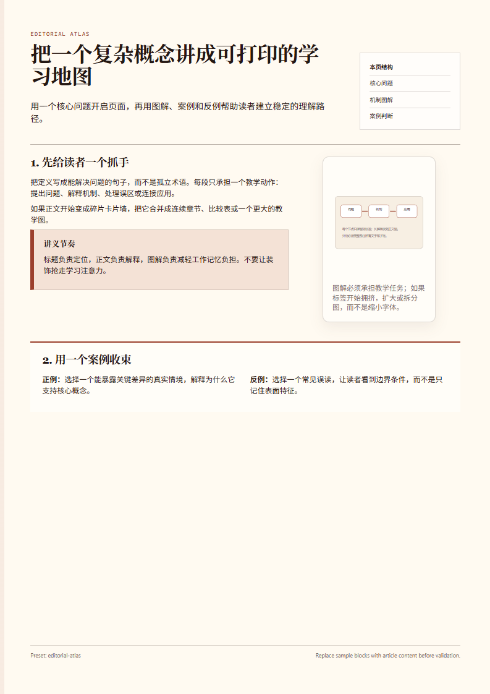
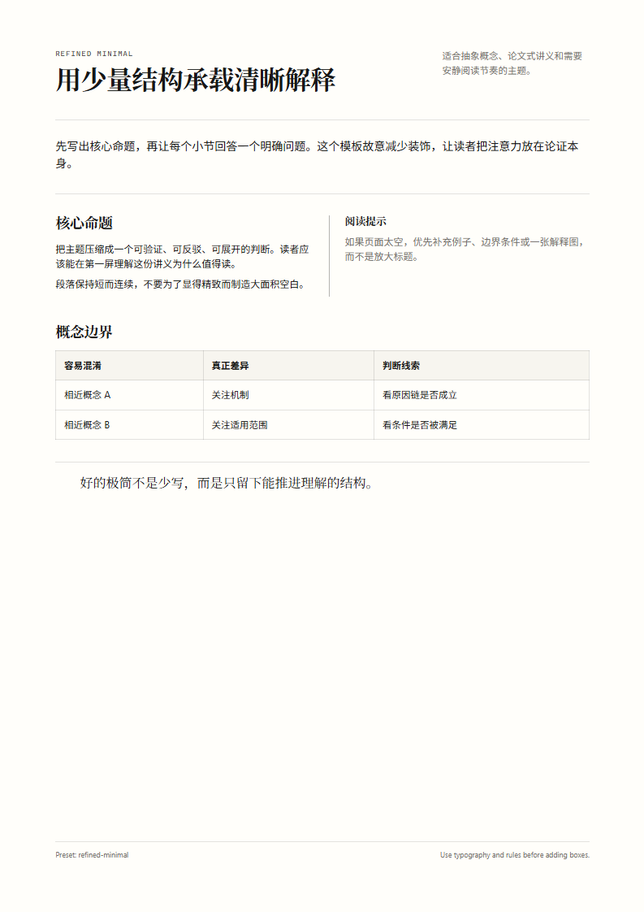
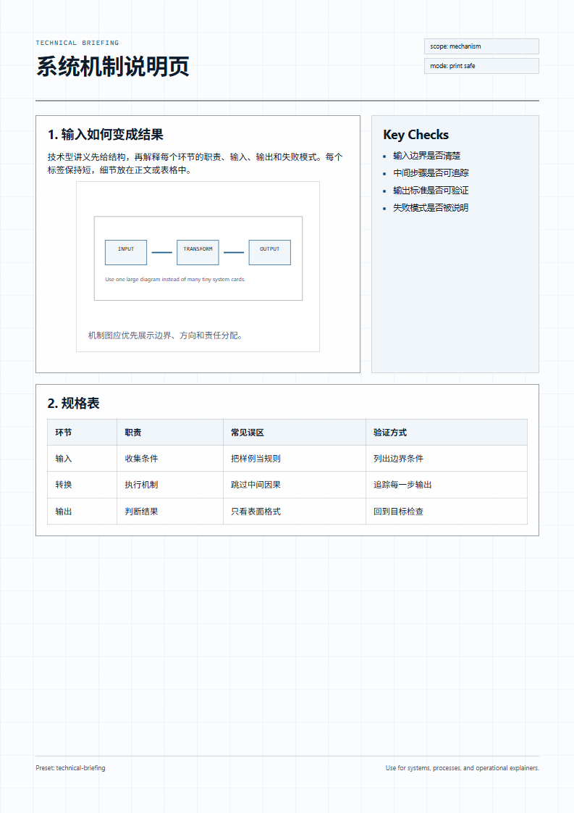
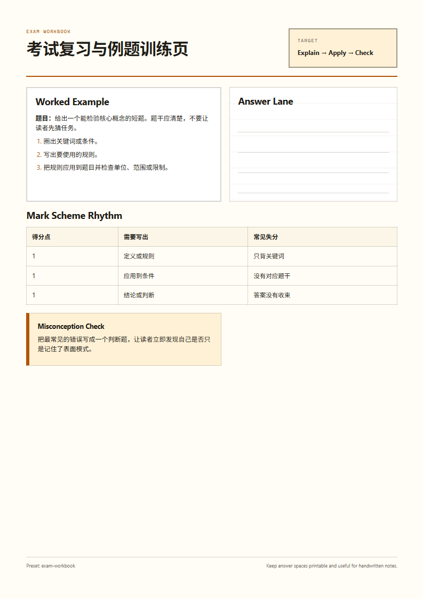
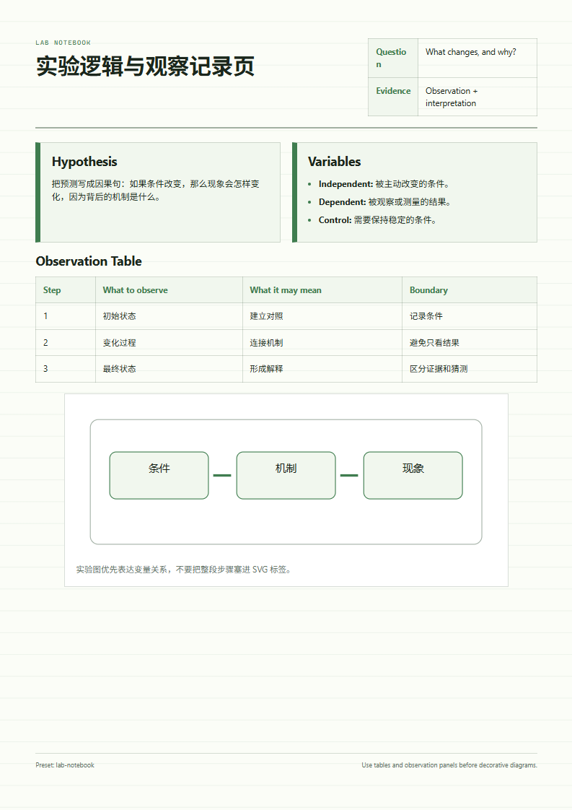
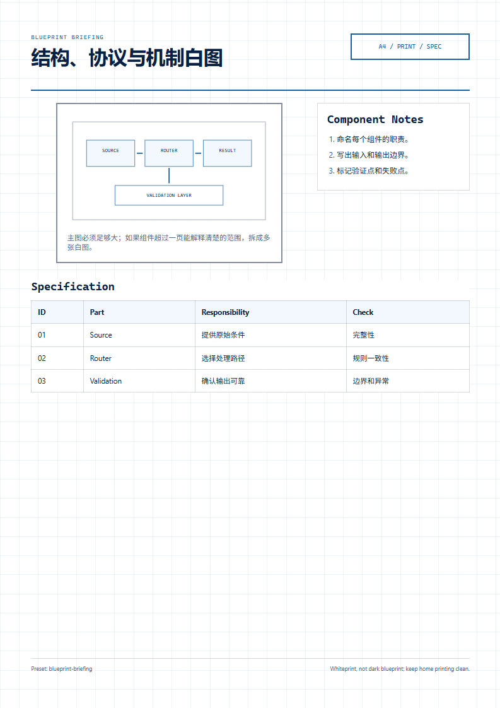
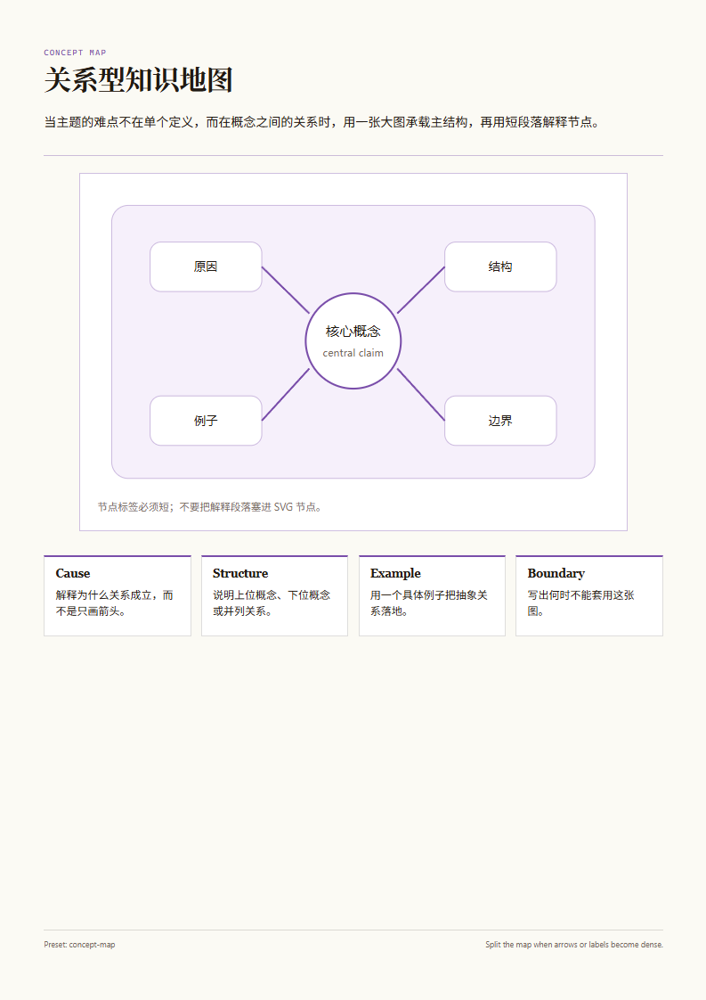
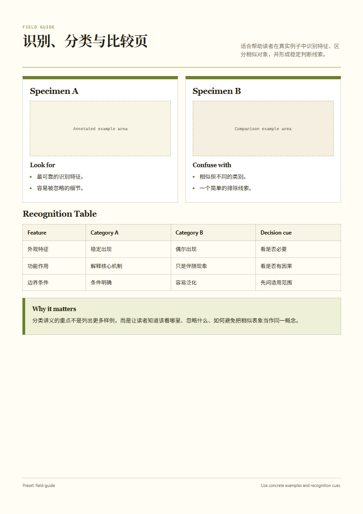

# Print Preset Templates

Copy one preset folder as the starting point for a new `knowledge-to-print-html` artifact.

Each preset folder contains:

- `handout.html` — a ready-to-edit A4 `.sheet` skeleton
- `style.css` — preset-specific tokens, typography, and section styling
- `preview.png` — a rendered first-page preview for human visual selection

All preset templates also use:

- `_shared/print-base.css` — shared print layout, wrapping, break-avoid, and A4 rules

## How To Use

1. Choose a preset using `references/visual-presets.md`.
2. Copy the chosen `handout.html` into the artifact folder.
3. Copy the chosen `style.css` into the artifact folder.
4. Copy `_shared/print-base.css` into the artifact folder, or inline it into `handout.html` when the user needs a single-file handout.
5. Update the links in `handout.html` if the CSS files are moved.
6. Replace the sample teaching blocks with the real `article.md` content.
7. Run `scripts/validate_print_layout.py`, then `scripts/review_print_pages.py`.

## Regenerate Previews

Run this after changing preset HTML/CSS:

```bash
python scripts/render_preset_previews.py --no-auto-install
```

## Built-In Presets

| Preset | Best for | Starting point | Preview |
|---|---|---|---|
| `editorial-atlas` | General explainers and rich tutorial pages | `editorial-atlas/handout.html` |  |
| `refined-minimal` | Serious essays and premium book-like handouts | `refined-minimal/handout.html` |  |
| `technical-briefing` | Systems, processes, engineering, and operations | `technical-briefing/handout.html` |  |
| `exam-workbook` | Revision notes, worksheets, and worked examples | `exam-workbook/handout.html` |  |
| `lab-notebook` | Experiments, observations, methods, and variables | `lab-notebook/handout.html` |  |
| `blueprint-briefing` | Architecture, protocols, mechanisms, and specs | `blueprint-briefing/handout.html` |  |
| `concept-map` | Relationship-heavy overviews and mental models | `concept-map/handout.html` |  |
| `field-guide` | Classification, comparison, and recognition primers | `field-guide/handout.html` |  |

## Print Safety Rules

- Keep `.sheet` as the page wrapper.
- Keep `@page { size: A4; margin: 0; }`.
- Keep text wrapping and break-avoid rules from `_shared/print-base.css`.
- Do not shrink body text or crush line height to fit content.
- Do not rely on `overflow: hidden` to hide broken layout.
- Keep SVG labels and grouped frames readable at print scale.
