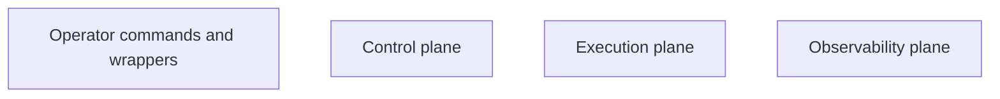
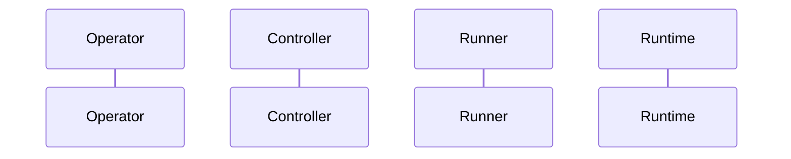
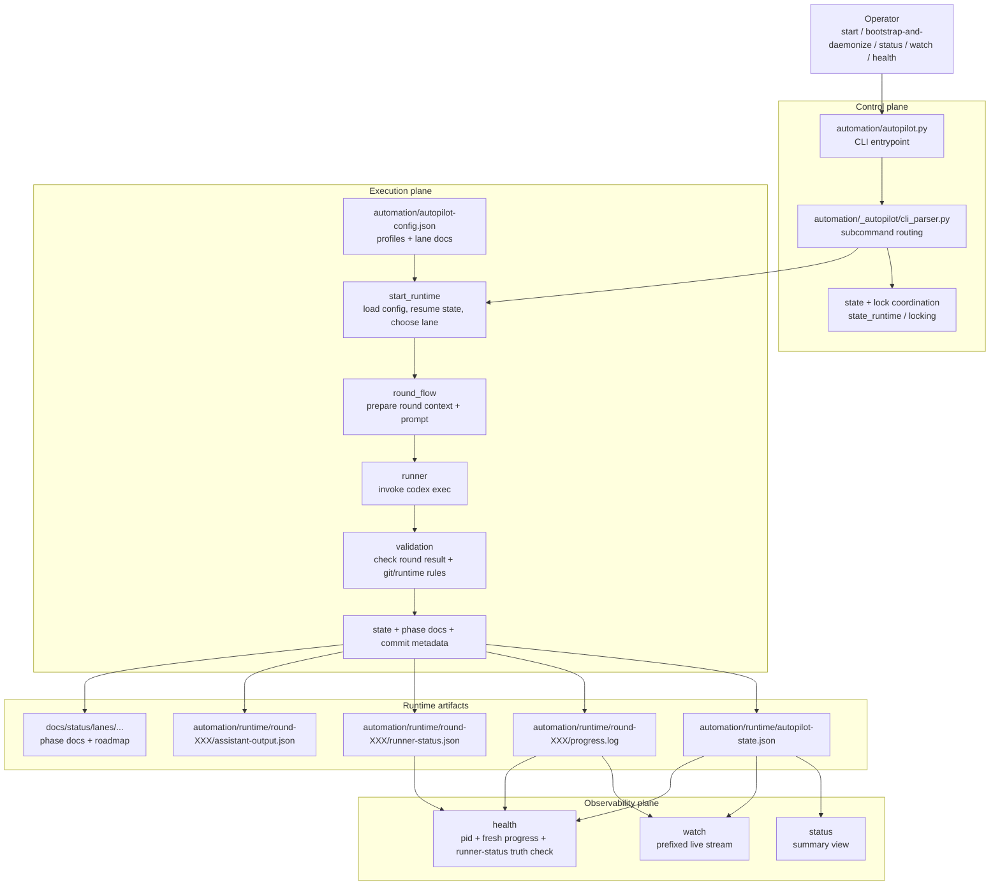
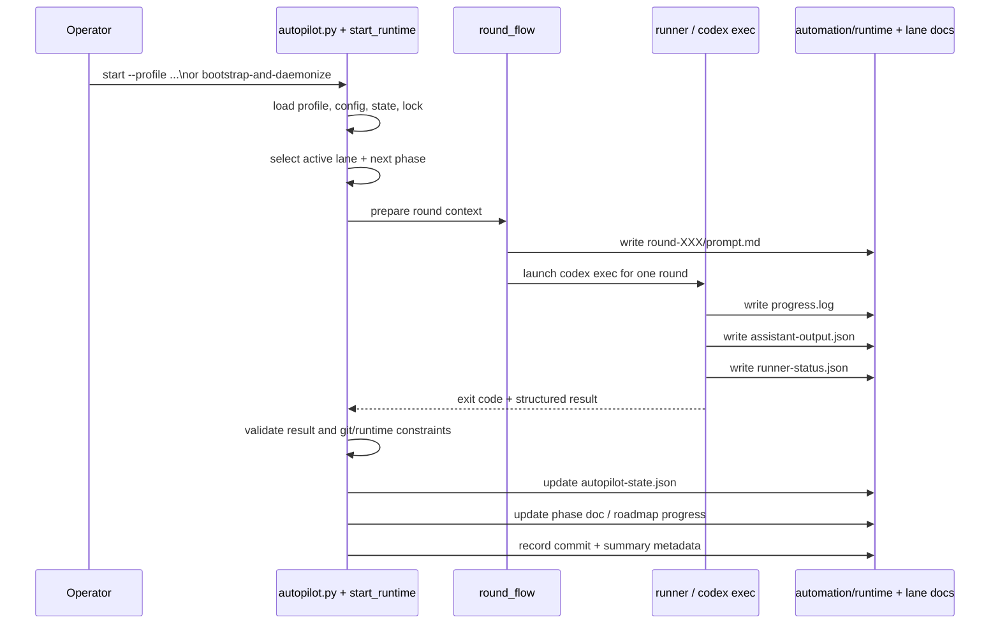

# Codex Autopilot Runtime Architecture Implementation Plan

> **For agentic workers:** REQUIRED SUB-SKILL: Use superpowers:subagent-driven-development (recommended) or superpowers:executing-plans to implement this plan task-by-task. Steps use checkbox (`- [ ]`) syntax for tracking.

**Goal:** Add a standalone runtime architecture explainer for `custom/codex-autopilot-scaffold` and link it from `SKILL.md` so readers can understand the generated repo runtime at a glance.

**Architecture:** Keep the implementation docs-only. Add one Markdown explainer with two Mermaid diagrams: a layered runtime architecture view and a single-round sequence view. Update `SKILL.md` near the top so readers can discover the explainer before diving into presets and operator procedures.

**Tech Stack:** Markdown, Mermaid, existing repo docs structure

---

## File Structure

- Create: `custom/codex-autopilot-scaffold/RUNTIME-ARCHITECTURE.md`
  - Purpose: standalone reader-facing explainer for the generated target-repo runtime
- Modify: `custom/codex-autopilot-scaffold/SKILL.md`
  - Purpose: add a prominent link to the standalone explainer near the primary entrypoint / generated-repo description
- Reference: `custom/codex-autopilot-scaffold/templates/common/automation/README.md`
  - Purpose: source of truth for generated runtime files and operator guarantees
- Reference: `custom/codex-autopilot-scaffold/templates/common/automation/autopilot.py`
  - Purpose: thin CLI entrypoint for the explainer’s control-plane wording
- Reference: `custom/codex-autopilot-scaffold/templates/common/automation/_autopilot/cli_parser.py`
  - Purpose: source of operator command surfaces shown in the diagram
- Reference: `custom/codex-autopilot-scaffold/templates/common/automation/_autopilot/round_flow.py`
  - Purpose: source of single-round lifecycle wording in the sequence diagram

### Task 1: Add standalone runtime architecture explainer

**Files:**
- Create: `custom/codex-autopilot-scaffold/RUNTIME-ARCHITECTURE.md`
- Reference: `custom/codex-autopilot-scaffold/templates/common/automation/README.md`
- Reference: `custom/codex-autopilot-scaffold/templates/common/automation/autopilot.py`
- Reference: `custom/codex-autopilot-scaffold/templates/common/automation/_autopilot/cli_parser.py`
- Reference: `custom/codex-autopilot-scaffold/templates/common/automation/_autopilot/round_flow.py`

- [ ] **Step 1: Draft the document skeleton**

````md
# Codex Autopilot Runtime Architecture

## What this shows

This document explains the generated target-repo runtime after the scaffold has already been installed. It focuses on how the repo-local Python controller drives unattended rounds, where the runtime artifacts live, and how `status`, `watch`, and `health` observe the run.

## Main runtime architecture



## Single-round sequence



## Key runtime artifacts

## Reading the runtime in practice

## What is intentionally out of scope
````

- [ ] **Step 2: Fill in the main layered Mermaid diagram**

````md

````

- [ ] **Step 3: Fill in the single-round sequence Mermaid diagram**

````md

````

- [ ] **Step 4: Add the explanatory bullets under the diagrams**

```md
- The controller is the durable loop owner; `codex exec` is only the worker for one round.
- `automation/autopilot-config.json`, profile JSON, and lane docs together define what the next round should attempt.
- `automation/runtime/autopilot-state.json` is the summary state used by `status` and also part of `health`.
- `progress.log` is the human-readable live stream that `watch` follows.
- `runner-status.json` is the strongest proof that a child `codex exec` is actually alive, so `health` uses it together with pid and log freshness.
- Lane phase docs and roadmap docs explain what slice was just completed and what should happen next.
```

- [ ] **Step 5: Add the scope boundary note**

```md
This explainer intentionally leaves out advanced operator flows such as `review-gated` review wrappers, remote Mac rollout, and `restart-after-next-commit`. Those features sit on top of the same runtime skeleton shown here.
```

- [ ] **Step 6: Inspect the final document for structure and rendering sanity**

Run: `Get-Content -Raw custom/codex-autopilot-scaffold/RUNTIME-ARCHITECTURE.md`
Expected: the document contains exactly two Mermaid fences, the section headings from the spec, and no unfinished placeholder markers

- [ ] **Step 7: Commit**

```bash
git add custom/codex-autopilot-scaffold/RUNTIME-ARCHITECTURE.md
git commit -m "docs: add codex autopilot runtime architecture explainer"
```

### Task 2: Link the explainer from `SKILL.md`

**Files:**
- Modify: `custom/codex-autopilot-scaffold/SKILL.md`
- Reference: `custom/codex-autopilot-scaffold/RUNTIME-ARCHITECTURE.md`

- [ ] **Step 1: Add a short architecture-doc callout near the top of `SKILL.md`**

```md
Generated runtime architecture overview:

- See `RUNTIME-ARCHITECTURE.md` for a visual explanation of how the scaffolded target repo runs rounds, writes runtime artifacts, and exposes `status` / `watch` / `health`.
```

- [ ] **Step 2: Place the callout in the discovery-friendly section**

Run: `rg -n "Primary entrypoint|Generated runtime architecture overview|Generated repos get" custom/codex-autopilot-scaffold/SKILL.md`
Expected: the new callout appears near the primary entrypoint / generated-repo overview instead of being buried near the bottom

- [ ] **Step 3: Re-read the modified section for flow**

Run: `Get-Content -Raw custom/codex-autopilot-scaffold/SKILL.md`
Expected: the new callout reads naturally and does not interrupt the use / do-not-use guidance

- [ ] **Step 4: Commit**

```bash
git add custom/codex-autopilot-scaffold/SKILL.md
git commit -m "docs: link autopilot runtime architecture guide"
```

### Task 3: Validate the finished docs as a coherent handoff

**Files:**
- Validate: `custom/codex-autopilot-scaffold/RUNTIME-ARCHITECTURE.md`
- Validate: `custom/codex-autopilot-scaffold/SKILL.md`

- [ ] **Step 1: Check the standalone doc against the spec**

Run: `rg -n "Main runtime architecture|Single-round sequence|Key runtime artifacts|What is intentionally out of scope" custom/codex-autopilot-scaffold/RUNTIME-ARCHITECTURE.md`
Expected: each required section heading from the approved spec is present exactly once

- [ ] **Step 2: Check for forbidden placeholders**

Run: `pwsh -NoLogo -Command "$patterns = @('T'+'BD','TO'+'DO','FI'+'XME','implement la'+'ter','fill in det'+'ails'); Select-String -Path 'custom/codex-autopilot-scaffold/RUNTIME-ARCHITECTURE.md','custom/codex-autopilot-scaffold/SKILL.md' -Pattern $patterns"`
Expected: no matches

- [ ] **Step 3: Verify the artifact and command language is current**

Run: `rg -n "autopilot-state.json|progress.log|runner-status.json|assistant-output.json|status|watch|health" custom/codex-autopilot-scaffold/RUNTIME-ARCHITECTURE.md`
Expected: the doc explicitly names the current runtime artifacts and all three observability commands

- [ ] **Step 4: Review the diff for scope**

Run: `git diff -- custom/codex-autopilot-scaffold/RUNTIME-ARCHITECTURE.md custom/codex-autopilot-scaffold/SKILL.md`
Expected: the diff is docs-only and limited to the new explainer plus the top-level link entry

- [ ] **Step 5: Commit**

```bash
git add custom/codex-autopilot-scaffold/RUNTIME-ARCHITECTURE.md custom/codex-autopilot-scaffold/SKILL.md
git commit -m "docs: add autopilot runtime architecture guide"
```
